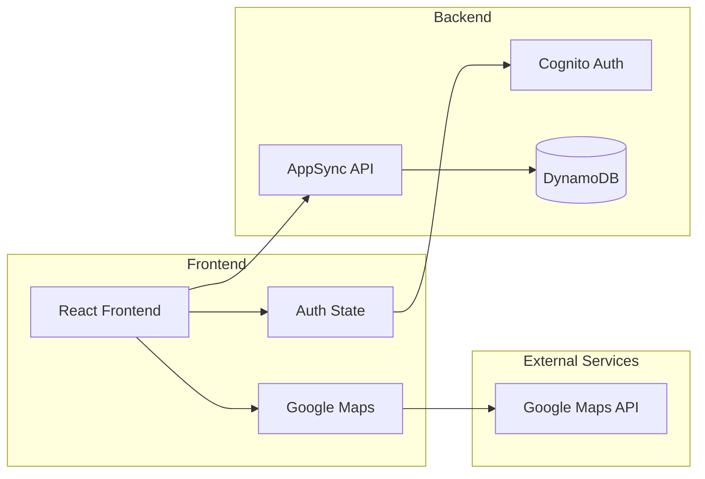
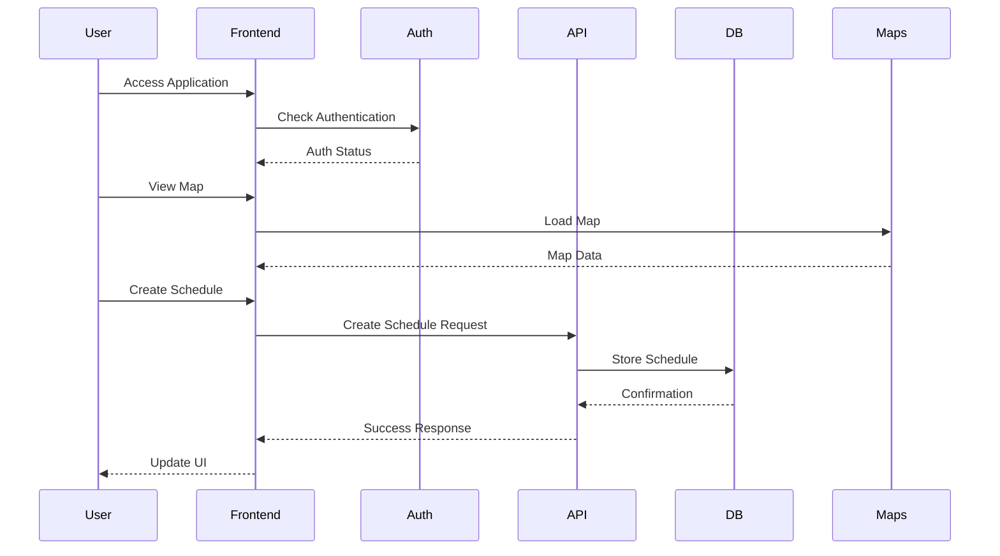
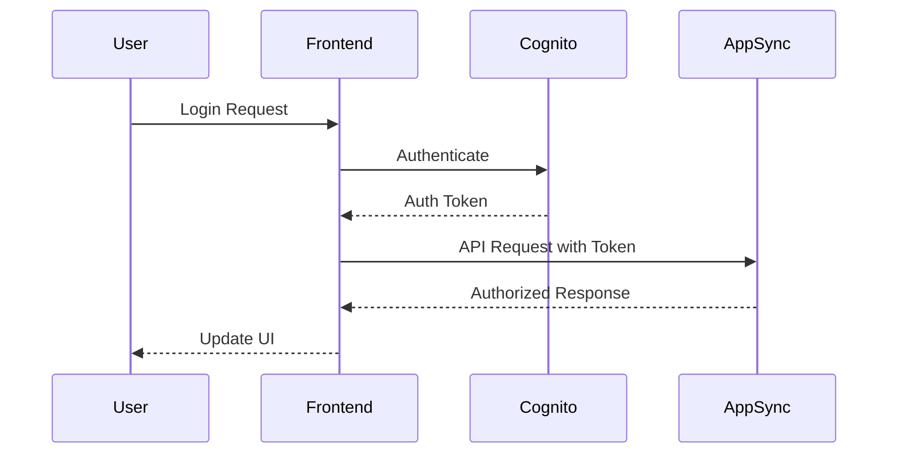

# System Architecture

## Frontend Architecture
```mermaid
graph TD
    subgraph Frontend
        UI[User Interface]
        subgraph Components
            Common[Common Components]
            Layout[Layout Components]
            Pages[Page Components]
        end
        subgraph State Management
            Auth[Authentication State]
            App[Application State]
        end
        subgraph Services
            API[API Service]
            Maps[Google Maps Service]
        end
    end

    UI --> Components
    Components --> Pages
    Pages --> State Management
    Pages --> Services
    Services --> API
    Services --> Maps
```

## System Integration


## Data Flow


## Component Structure
```mermaid
graph TD
    subgraph Frontend Components
        Layout[Layout]
        Header[Header]
        Footer[Footer]
        
        subgraph Common Components
            Button[Button]
            Input[Input]
            Card[Card]
            Modal[Modal]
            Loading[Loading]
        end
        
        subgraph Pages
            Home[Home]
            Login[Login]
            Register[Register]
            Profile[Profile]
            Schedules[Schedules]
            Requests[Requests]
        end
    end

    Layout --> Header
    Layout --> Footer
    
    Layout --> Pages
    Pages --> Common Components
```

## Authentication Flow
